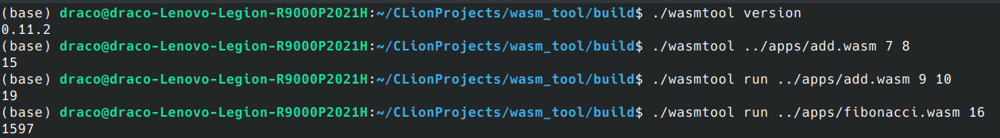

# WasmTool

WasmTool is an implementation for [WasmEdge LFX mentorship pretest](https://github.com/WasmEdge/WasmEdge/discussions/2227).

## Build

Before building WasmTool, you need to install [WasmEdge](https://github.com/WasmEdge/WasmEdge) and cmake first.

```bash
git clone https://github.com/dracoooooo/WasmTool.git
cd WasmTool
mkdir build && cd build
cmake ..
make
```

## Usage

```bash
wasmtool [version] [run] [wasm path] [arguments]
`version` is optional and prints the used wasmedge version; if this is given, you can ignore any other options.
`run` is optional.
`wasm path` is required; the relative and absolute path should be supported.
`arguments` is optional; some of the hidden wasm applications may not have arguments.
```

## Examples

